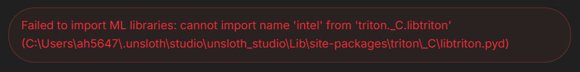
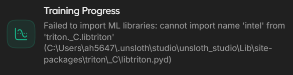

# Fixing Unsloth Studio on Intel Laptops (Windows 11)

> This guide is a companion to the [midterm project README](readme.md). It exists
> for one specific hardware situation. If you are not in that situation, you do
> not need any of it.

## Is this guide for you?

Yes, if **all** of these are true:

- You are on Windows 11
- Your laptop has an Intel graphics chip, not an NVIDIA one (Intel Core Ultra processors such as the 258V or 268V, which show up as "Intel(R) Arc(TM) 140V GPU")
- Unsloth Studio is failing with one of the errors listed below

No, if you have an NVIDIA graphics card. None of this applies to you.

**Time needed:** about 45 minutes, most of it waiting for downloads.
**Disk space needed:** about 10 GB.

**If you get stuck:** there is a fallback that requires no installation at all. See [Part 6](#part-6-if-none-of-this-works) at the end. Do not spend hours fighting this guide when an assignment is due.

> ### These steps were verified on one machine, not yours
>
> This guide was written from a working repair on a single Intel laptop. Driver
> versions, Unsloth Studio releases, and Windows updates all move independently.
> Every path and version number below is an **example**. You are expected to look
> up your own values where the guide tells you to, confirm each command actually
> did what it claims, and run the test in [Part 3](#part-3-test-it) before you
> trust the setup. If a step does not match what you see on screen, stop and work
> out why rather than pressing on.

---

## The errors this fixes

Any of these:

- `Failed to import ML libraries: cannot import name 'intel' from 'triton._C.libtriton'` when Studio starts up

  

  

- `Failed to load checkpoint: We encountered some issues during automatic conversion of the weights.` when you try to export to GGUF

  

- A long list in the log where many lines end in `MISSING` or `CONVERSION`
- `Failed to find C compiler` or `Failed to find C++ compiler` anywhere in the log

These look like four different problems. They are one problem.

### What is actually wrong

On Intel graphics, Unsloth has to build a small piece of software on your computer while it runs. To build software you need a compiler. Windows does not come with one, and the Unsloth installer does not install one or check whether you have one.

When the compiler is missing, the failure gets reported in a confusing place. The message talks about model weights, but the weights are fine. The compiler is the problem.

This guide installs the missing pieces.

---

## Read this before you start

### One thing you must never do

While searching for a fix, you may find a suggestion to open a file called `loading_report.py` and delete or comment out a line that says `raise RuntimeError`. Some people online recommend this. **Do not do it.**

That line is a safety check. If you remove it, the export will appear to work and will produce a model file that is completely broken. It will not warn you. It will load, it will answer questions, and every answer will be nonsense, because the model contains random numbers instead of trained weights.

If you have already done this, reinstall Unsloth Studio from scratch before following this guide.

### Two different black windows

This guide uses two Windows programs that look almost identical. Using the wrong one is the single most common way to get stuck.

**Command Prompt.** Press `Win + R`, type `cmd`, press Enter. The prompt looks like:

```
C:\Users\yourname>
```

**PowerShell.** Press `Win + X`, then choose "Terminal" or "Windows PowerShell". The prompt looks like:

```
PS C:\Users\yourname>
```

The difference is the `PS` at the start. If you paste a PowerShell command into Command Prompt, or the reverse, you will get errors like `'Get-ChildItem' is not recognized` or `The term '%py%' is not recognized`. Those errors mean wrong window, not broken computer.

Every command block below says which window to use.

### How to copy and paste

Right-click inside either window pastes whatever you copied. `Ctrl+V` also works on Windows 11. To copy text out, select it with the mouse and press `Ctrl+C`.

### A note on paths

The commands below use `$HOME` (PowerShell) and `%USERPROFILE%` (Command Prompt) so they resolve to **your** account automatically. Where a full path is written out, such as the Visual Studio and Intel oneAPI folders, the version numbers in it are examples from one machine. You will look up your own in [step 2a](#2a-find-your-version-numbers). Never paste a path you have not confirmed exists, especially not one with `Remove-Item -Recurse -Force` in front of it.

---

# Part 1: Install the missing pieces

Do these three in order. Order matters for the third one.

## 1a. Intel graphics driver

Go to Intel's website, search for "Intel Arc driver", and install the current driver for your laptop.

If Unsloth Studio already shows your GPU when it starts (something like "Intel(R) Arc(TM) 140V GPU"), you already have this and can skip it.

## 1b. Visual Studio Build Tools

This provides the compiler. It is a Microsoft product and it is free.

1. Search the web for "Build Tools for Visual Studio" and go to Microsoft's official download page. Look under the heading "Tools for Visual Studio".
2. Download and run the installer. You do **not** need full Visual Studio, only Build Tools.
3. In the installer, on the "Workloads" tab, tick **Desktop development with C++**.
4. Now switch to the **Individual components** tab at the top. In the search box, type `v143`. Tick **MSVC v143 - VS 2022 C++ x64/x86 build tools (Latest)**.
5. Click Install. This is the big download, roughly 7 GB.

Step 4 is not optional and is easy to miss. The newest compiler version that comes by default does not work with Intel's tools. You need this slightly older one installed alongside it.

## 1c. Intel oneAPI compiler

**Install this after step 1b, not before.** If you install it first, it will not set itself up correctly.

Search for "Intel oneAPI Base Toolkit" and install it from Intel's website. If you are offered a choice of components, you only need the DPC++/C++ Compiler, though installing everything is fine and simpler.

---

# Part 2: Set up your computer

## 2a. Find your version numbers

Different machines get different version numbers. You need to look up two of them. Do not copy the numbers from the example output, look up your own.

**Open PowerShell** and paste this in one go:

```powershell
Get-ChildItem "C:\Program Files (x86)\Microsoft Visual Studio\*\BuildTools\VC\Tools\MSVC" -Directory | Select-Object FullName
Get-ChildItem "C:\Program Files (x86)\Intel\oneAPI\compiler" -Directory | Select-Object FullName
```

You will get output something like this:

```
C:\Program Files (x86)\Microsoft Visual Studio\18\BuildTools\VC\Tools\MSVC\14.44.35207
C:\Program Files (x86)\Microsoft Visual Studio\18\BuildTools\VC\Tools\MSVC\14.51.36231
C:\Program Files (x86)\Intel\oneAPI\compiler\2026.1
C:\Program Files (x86)\Intel\oneAPI\compiler\latest
```

Write down two things:

1. **The Visual Studio number.** In the example above it is `18`. It might be `17` on your machine.
2. **The oneAPI number.** In the example above it is `2026.1`. Ignore the `latest` line.

Also check: is there a line with `14.4` something in it, like `14.44.35207`? If you only see `14.5` numbers, go back to step 1b and add the individual component. Nothing below will work without it.

## 2b. Repair the Unsloth Triton installation

Skip this section if Studio starts up without the `cannot import name 'intel'` error. If in doubt, running it anyway does no harm.

First, close Unsloth Studio completely.

**Open PowerShell** and paste this block in one go. It will take a few minutes and print a lot of text.

```powershell
$py = "$HOME\.unsloth\studio\unsloth_studio\Scripts\python.exe"
$sp = "$HOME\.unsloth\studio\unsloth_studio\Lib\site-packages"

Get-Process *unsloth* -ErrorAction SilentlyContinue | Stop-Process -Force

Remove-Item -Recurse -Force "$sp\triton" -ErrorAction SilentlyContinue
Remove-Item -Recurse -Force "$sp\triton-*.dist-info" -ErrorAction SilentlyContinue
Remove-Item -Recurse -Force "$sp\pytorch_triton_xpu-*.dist-info" -ErrorAction SilentlyContinue
Remove-Item -Recurse -Force "$HOME\.triton\cache" -ErrorAction SilentlyContinue

& $py -m pip install --force-reinstall --index-url https://download.pytorch.org/whl/xpu pytorch-triton-xpu
```

If PowerShell reports that `$py` does not exist, your Unsloth Studio install is somewhere other than `$HOME\.unsloth`. Find it before going any further and adjust both variables at the top of the block.

Then check it worked. **Still in PowerShell**, paste:

```powershell
& $py -c "from triton._C.libtriton import intel; print('triton xpu OK')"
& $py -c "import torch; print(torch.__version__, torch.xpu.is_available())"
```

You want to see `triton xpu OK` and then a version number followed by `True`.

If you see `False`, stop here and ask for help. Everything after this point depends on it saying `True`.

## 2c. Create your two startup files

Unsloth Studio has to be started in a particular way from now on. The Start Menu shortcut will no longer work correctly. Instead you will use a file you create once and then double-click forever after.

### Creating the file (read this carefully)

Notepad will try to save your file as a text file, which will not work. Follow these steps exactly.

1. Open Notepad.
2. Paste the text from the box below.
3. Edit the two version numbers to match what you wrote down in step 2a.
4. Click File, then Save As.
5. Navigate to your Desktop.
6. **Change "Save as type" from "Text Documents (\*.txt)" to "All Files (\*.\*)".** This is the step people miss.
7. Type the filename exactly, including the `.bat` at the end.
8. Click Save.

If you end up with a file called `start-unsloth.bat.txt`, step 6 did not happen. Delete it and try again.

### File 1: `start-unsloth.bat`

```bat
@echo off
call "C:\Program Files (x86)\Microsoft Visual Studio\18\BuildTools\VC\Auxiliary\Build\vcvarsall.bat" x64 -vcvars_ver=14.4
set "LIB=C:\Program Files (x86)\Intel\oneAPI\compiler\2026.1\lib;%LIB%"
set CC=C:\Program Files (x86)\Intel\oneAPI\compiler\2026.1\bin\icx.exe
set CXX=C:\Program Files (x86)\Intel\oneAPI\compiler\2026.1\bin\icpx.exe
unsloth studio -H 0.0.0.0 -p 8888
```

### File 2: `test-unsloth.bat`

```bat
@echo off
call "C:\Program Files (x86)\Microsoft Visual Studio\18\BuildTools\VC\Auxiliary\Build\vcvarsall.bat" x64 -vcvars_ver=14.4
set "LIB=C:\Program Files (x86)\Intel\oneAPI\compiler\2026.1\lib;%LIB%"
set CC=C:\Program Files (x86)\Intel\oneAPI\compiler\2026.1\bin\icx.exe
set CXX=C:\Program Files (x86)\Intel\oneAPI\compiler\2026.1\bin\icpx.exe
set py=%USERPROFILE%\.unsloth\studio\unsloth_studio\Scripts\python.exe
echo Testing, this can take up to a minute the first time...
%py% -c "import torch, bitsandbytes as bnb; x=torch.randn(4096,4096,dtype=torch.bfloat16,device='xpu'); q,s=bnb.functional.quantize_4bit(x); print('SUCCESS: bnb 4bit ok', q.shape)"
echo.
pause
```

### What to change in both files

Change only these two things:

- `\18\` becomes your Visual Studio number from step 2a
- `2026.1` becomes your oneAPI number from step 2a, in all three places it appears

### What NOT to change

**Leave `-vcvars_ver=14.4` exactly as it is.** It is not a version number you need to look up. It is a shorthand that automatically finds whichever `14.4` something you have installed. If you replace it with the full number like `14.44.35207`, it will break on other machines.

---

# Part 3: Test it

Double-click **`test-unsloth.bat`** on your Desktop.

A black window opens. It will print some setup text, then pause for anywhere from ten seconds to a minute while it builds something. You will see two warning messages mentioning `-fsycl` and "dynamic C++ runtime". **Ignore those warnings, they are normal and harmless.**

### If it worked

Near the bottom you will see:

```
SUCCESS: bnb 4bit ok torch.Size([8388608, 1])
```

You are finished with setup. Press any key to close the window and go to Part 4.

### If the window closed instantly

The file was saved as `.txt` instead of `.bat`. Go back to step 2c.

### If you see an error

Find your error in Part 5 below. Copy the last twenty lines of the window before you close it, in case you need to ask for help.

---

# Part 4: Everyday use

**To start Unsloth Studio:** double-click `start-unsloth.bat`. That is the only way to start it from now on. Do not use the Start Menu shortcut or the desktop app icon.

A black window will open and stay open. Leave it open. Closing it closes Studio. Your browser will open Studio as normal.

**When you export a GGUF:** the first export after setup will be slower than usual while it builds a few more pieces. Later exports are fast.

## Set the optimizer before every training run

Unsloth Studio defaults its optimizer to `adamw_8bit` or `paged_adamw_8bit`. Those are bitsandbytes 8-bit optimizers, supported on NVIDIA CUDA and **not** supported by the Intel XPU backend.

On XPU they do not raise an error. The run starts, the bar advances, Studio says the run finished, and nothing trained. The model you export afterwards is the base model wearing your project's name.

In the training configuration, under the advanced parameters, set **Optimizer** to **`adamw_torch`**. Check it every time. A fresh project, a reloaded configuration, or a Studio update can put the default back.

If you suspect it happened: your loss never moved off its starting value, or grad norm stayed at zero. Use **Compare in Chat** after training to run the base model and your fine-tuned model against the same prompt from your training data. Identical answers mean no training occurred.

## Always check your exported model

An exported model can be broken in ways that produce no error. Test every one before you rely on it.

**Open Command Prompt** and run, putting your own file path in:

```
%USERPROFILE%\.unsloth\llama.cpp\build\bin\Release\llama-cli.exe --model "C:\full\path\to\your-model.gguf" -p "why is the sky blue?"
```

You should get a sensible answer. If you get gibberish, repeated characters, or random words, the export is broken. Do not use it.

Then ask it something from your training data and check that it responds the way your fine-tuned model should, rather than the way the original model would.

One thing to watch: if your final training loss was very low, below about 0.05, your model has probably memorized a small dataset rather than learned from it. It will look impressive on your training examples and perform poorly on anything else.

For the assignment, this is not the whole check. Once the model loads and speaks sense, run it through the `model_report` tooling described in [Task 2.1 of the README](readme.md#21-test-your-exported-model-locally-model_report) against your held-out split, and confirm it emits schema-valid JSON.

---

# Part 5: If something goes wrong

Find your error message in the left column. You do not need to understand the middle column.

| The error says | What is wrong | What to do |
|---|---|---|
| `'Get-ChildItem' is not recognized` | You pasted a PowerShell command into Command Prompt | Open PowerShell instead |
| `'%py%' is not recognized` | You pasted a Command Prompt command into PowerShell | Open Command Prompt instead |
| Window closes instantly when double-clicked | The file saved as `.txt` not `.bat` | Redo step 2c, changing "Save as type" to "All Files" |
| `Toolset directory for version '14.4' was not found` | The extra component from step 1b was not installed | Rerun the Build Tools installer and add the `v143` individual component |
| `sycl headers not found`, or `AssertionError` in `find_sycl` | A support package is missing | In PowerShell: `& $py -m pip install "intel-sycl-rt==2025.3.1"` |
| `Failed to find C compiler` or `C++ compiler` | You did not start from your `.bat` file | Always launch from `start-unsloth.bat` |
| Something about `yvals_core.h` and `__no_specializations__` | Using the wrong compiler version | Check `-vcvars_ver=14.4` is still in your `.bat` file, unmodified |
| `LNK1181: cannot open input file 'sycl8.lib'` | Intel tools got added to your system PATH | Do not run `setvars.bat`. See the note below |
| `LNK1104: cannot open file 'libmmt.lib'` | The `set "LIB=..."` line is missing or has a wrong version number | Check that line in your `.bat` file |
| `cstddef file not found` | The Visual Studio setup line failed | Look at the top of the window for an error from `vcvarsall.bat` |
| `D8021: invalid numeric argument '/Wno-psabi'` | `CC` is pointing at the wrong compiler | Check the `CC` and `CXX` lines say `icx.exe` and `icpx.exe` |
| `Failed to load checkpoint` after all of this | Something in the chain is still broken | Run `test-unsloth.bat` and troubleshoot that instead, it gives clearer errors |
| Training reports finished, but the model behaves exactly like the base model | The 8-bit optimizer silently does nothing on Intel XPU | Set **Optimizer** to `adamw_torch` in the training configuration and train again |

## An important warning about setvars.bat

Intel's documentation tells you to run a file called `setvars.bat` before using their tools. **Do not do this for Unsloth.** It looks like the correct thing to do and it breaks the setup.

The short version: running it causes Unsloth to look for a file in a folder where that file does not exist. Leaving it alone causes Unsloth to look in a different folder where the file does exist. Your `.bat` files reach Intel's compiler by full path instead, which gets the compiler without causing the problem.

If you have already run it in a window, close that window and open a fresh one.

## Never edit program files

If you find yourself opening files inside a folder called `site-packages` and changing them to make an error go away, stop. Those changes get erased by updates, they break in ways that are hard to diagnose, and in at least one case they silently produce a broken model that looks fine.

## After an Unsloth update

Updates can undo the repair in step 2b. If exports start failing again after an update, run `test-unsloth.bat`. If it fails, redo step 2b, then test again.

## Getting help

If you are stuck, include all of this:

1. Which step you were on
2. The last twenty lines from the black window, copied as text rather than a screenshot
3. The output of these two PowerShell commands:

```powershell
& $py -c "import torch; print(torch.__version__, torch.xpu.is_available())"
Get-ChildItem "C:\Program Files (x86)\Intel\oneAPI\compiler" -Directory | Select-Object Name
```

---

# Part 6: If none of this works

Use the Unsloth Colab notebook in this repository: **`Unsloth_Studio_Colab.ipynb`**, described in [Part II section C of the README](readme.md#c-cloud-fallback-jupyter-notebook-and-google-colab).

It runs entirely in your browser on Google's hardware. Nothing to install, no compiler, no Intel drivers, no version numbers. Open it in [Google Colab](https://colab.research.google.com/), sign in with a Google account, and work through it.

This is a legitimate way to complete the work, not a consolation prize. The local setup in this guide exists so you can train on your own machine without an internet connection or a usage quota. If it is not cooperating, that is a tooling problem and not a reflection of your ability. Switch to Colab, finish the assignment, and come back to the local setup later if you want to.

Two things to know about the Colab route:

- **Free Colab disconnects.** Sessions end after a period of inactivity or after a few hours, and you lose anything not saved. Download your exported model file as soon as it finishes rather than leaving it in the session.
- **The verification step in Part 4 still applies.** Always test that your exported model produces sensible output before submitting or relying on it, whichever machine produced it.
